zorg on Docker
===

> *Portable, Server independent, Docker-based code to get the zorg Websites and Services up, running, and hosted.*

---

**Table of Contents**
<!-- TOC maker: https://github.com/derlin/bitdowntoc -->

[🔖 Pre-requisites](#-pre-requisites)
- [git installation](#git-installation)
- [Docker installation](#docker-installation)
  - [🌐 DNS-records and Hosts](#-dns-records-and-hosts)
- [📂 Folder structure setup](#-folder-structure-setup)
- [💾 Docker images](#-docker-images)
- [🧬 Docker networking](#-docker-networks)

[🏁 Getting started](#-getting-started)
- [Initial setup (one time only)](#initial-setup-one-time-only)
- [⏩ Update the cloned `zorg-docker` git repository](#-update-the-local-cloned-zorg-docker-git-repository)

[📦 Docker services](#-docker-services)
- [Manage general services](#manage-general-services)
  - [Single «KeePass SFTP» service](#run-the-keepass-sftp-service-separately)
  - [Single «Quake 3 Arena Server»](#run-the-quake-3-arena-server-separately)
  - [Single «phpDocumentor» service](#run-the-phpdocumentor-service-separately)
  - [🏷️ Docker services -> profiles mapping](#-docker-services---profiles-mapping)
- [🩺 Resource usage & services health](#docker-resource-usage---services-health)
- [🆙 Update all Docker images](#-update-all-docker-images)

[👨‍🏫 Explanations](#-explanations)
- [🧪 Debugging Docker Services](#-debugging-docker-services)
- [🔥 Firewall ports configuration](#-firewall-ports-configuration)
- [📄 The `/zorg-docker/resources`-directory & files](#-the-zorg-dockerresources-directory--files)
- [🔁 logrotate handling](#-logrotate-must-be-done-on-the-host)
- [💿 Import/export SQL-dumps with MariaDB](#-importexport-sql-dumps-with-mariadb)

<br>

---

<br>

## 🔖 Pre-requisites
### git installation
Install **git** [for your OS](https://git-scm.com/book/en/v2/Getting-Started-Installing-Git).

<br>

### Docker installation
Following the [official installation instructions](https://docs.docker.com/engine/install/) for **Docker**.

> [!TIP]
> On Ubuntu it's advised *against installing via snap*, as this may cause compatibility issues!

<br>

#### 🌐 DNS-records and Hosts

For all Hosts (subdomains) on the main Domain, the correspoinding DNS A-records with IP must be set up.

<details>
<summary>Example A-records</summary>

```bash
mail.domain.ch.	        600	IN	MX	178.nn.nn.nn
*.domain.ch.	          600	IN	A	  178.nn.nn.nn
www.domain.ch.	        600	IN	A	  178.nn.nn.nn
dockerstatus.domain.ch.	600	IN	A	  178.nn.nn.nn
```
</details>

<br>

##### 👨‍💻 Working locally (development)? Add `hosts`!

On production a proper setup with pointing DNS for the root domain to the server's IP-address, this should not be necessary. But **locally** with a dummy domain, the domain & hostnames must be added to the `/etc/hosts`-file:

<details>
<summary>Example `hosts`-entries</summary>

(adjust as per your `.env` settings)

```bash
127.0.0.1	zdocker.dev
127.0.0.1	status.zdocker.dev
127.0.0.1	www.zdocker.dev
127.0.0.1	db.zdocker.dev
127.0.0.1	ftp.zdocker.dev
127.0.0.1	irc.zdocker.dev
127.0.0.1	pw.zdocker.dev
127.0.0.1	smtp.zdocker.dev
127.0.0.1	quake.zdocker.dev
```
</details>

<br><br>

## 🏁 Getting started
In general make sure to work from the project root directory:

`cd /srv/<my-website>/<host>`

<br>

### 📂 Folder structure setup
Creat the a folder structure on your host machine that reflects the following:

> [!IMPORTANT]
> This is just a proposal, folder structures & names can be different!

```
└── www               <-- (Your project root directory)
    │
    ├── zorg-docker/       <-- Pulled Git repository (repo)
    │
    ├── .env               <-- Copy & adjust ".env.example" from repo
    ├── docker-compose.yml <-- Symbolic-linked ./zorg-docker/docker-compose.yml
    ├── docker-update.sh   <-- Symbolic-linked ./zorg-docker/docker-update.sh
    │
    ├── reverseproxy/      <-- (Optional) To further customize OWASP WAF rules. Reference in .env
    │   └── owasp-coraza-waf.yaml
    |
    ├── website/           <-- zorg Website configs & data
    │   ├── .env           <-- .env file for Website
    │   ├── apache.conf      <-- Copy & adjust "website/apache/example.conf" from repo
    │   │   └── data/          <-- Website /data/ folder & files
    │   │   ├── files/         (user generated content for zorg website)
    │   │   ├── gallery/
    │   │   ├── tauschboerse/
    │   │   └── ...
    │   │
    │   ├── cronjobs/
    │   │   └── cronjobs.crontab   <-- Copy & adjust "website/php/example.crontab" from repo
    │   └── sendmail/
    │       └── msmtprc    <-- Copy & adjust "website/sendmail/example-msmtprc" from repo
    │
    ├── mailserver/        <-- (Optional) To further customize Postfix SMTP. Reference in .env
    │   └── postfix-main.cf
    |
    ├── irc/
    │   ├── anope-configs/    <-- Copy & adjust "irc/anope-example-sensitive-includes" from repo
    │   │   ├── sensitive-channels.conf
    │   │   ├── sensitive-mail.conf
    │   │   ├── sensitive-networkinfo.conf
    │   │   ├── sensitive-nicknames.conf
    │   │   ├── sensitive-operators.conf
    │   │   ├── sensitive-serverinfo.conf
    │   │   ├── sensitive-uplink.conf
    │   │   └── services.motd
    │   └── ircd-configs/     <-- Copy & adjust "irc/unrealircd-example-sensitive-includes" from repo
    │       ├── ircd.motd
    │       ├── sensitive-admin.conf
    │       ├── sensitive-history.conf
    │       ├── sensitive-me.conf
    │       ├── sensitive-network.conf
    │       ├── sensitive-operators.conf
    │       ├── sensitive-server.conf
    │       └── sensitive-servicelink.conf
    │
    ├── code-docu/
    │   ├── code/       <-- (Optional) Git clone of github.com/zorgch/zorg-code.git. Reference in .env
    │   ├── docu/       <-- (Optional) Reference in .env
    │   └── phpdoc.xml     <-- (Optional)
    │
    ├── keepass/         <-- Reference in .env Only AFTER sftp started: put kdbx file here.
    │
    ├── quake3-baseq3/   <-- Reference in .env
    │   ├── q3config_server.cfg   <-- Copy & adjust "quake3/example-server.cfg" from repo
    │   ├── pak0.pk3              <-- From a local licensed Quake3 installation
    │   └── pak1-8.pk3            <-- Can be obtained at: https://ioquake3.org/extras/patch-data/
    │
    └── logs/              <-- Reference in .env
        ├── cron/          <-- Sub-directories MUST also be created manually!
        ├── ircserver/
        ├── mailserver/
        ├── website/
        │   ├── apache/
        │   ├── php/
        │   └── website/
        ├── reverseproxy-owasp/
        ├── sftp/
        └── quake3-server/
```

<br>

### 💾 Docker images
Here's an overview of the underlaying Docker images used for the Docker Services, in order to provide quick access to their documentation & configuration how-to's.

<details>
<summary>Click to show list</summary>

| Service            | Docker image              | Link               |
| ------------------ | ------------------------- | ------------------ |
| `sslcerts`         | `alpine/mkcert`           | [GitHub](https://github.com/alpine-docker/multi-arch-docker-images/tree/master/mkcert) |
| `dashboard`        | `portainer/portainer-ce`  | [Docs](https://docs.portainer.io/start/install-ce/server/docker) |
| `reverseproxy`<br>+ `owasp-coraza-waf@file` | `traefik`<br>`coraza-http-wasm-traefik` | [Docs](https://doc.traefik.io/traefik/)<br>[GitHub](https://github.com/jcchavezs/coraza-http-wasm-traefik) |
| `website`          | `php`                     | [Docker Hub](https://hub.docker.com/_/php) |
| `db`               | `mariadb`                 | [Docs](https://mariadb.com/kb/en/mariadb-server-docker-official-image-environment-variables/) |
| `postfix-smtp`     | `mailserver/docker-mailserver` | [Docs](https://docker-mailserver.github.io/docker-mailserver/) |
| `irc`              | `c0dy/unrealircd-anope`   | [Docker Hub](https://hub.docker.com/r/c0dy/unrealircd-anope) |
| `irc-quizbot`      | `python:3.12-slim`        | [GitHub](https://github.com/zorgch/irc-quizbot) |
| `stockticker`      | `python:3.12-slim`        | [GitHub](https://github.com/zorgch/zorg-docker/tree/dev/resources/python/stockticker) |
| `servicealerts`    | `lorcas/docker-telegram-notifier` | [GitHub](https://github.com/luc-ass/docker-telegram-notifier) |
| `sftp`             | `atmoz/sftp`              | [Docker Hub](https://hub.docker.com/r/atmoz/sftp/) |
| `quake3`           | `jberrenberg/quake3`      | [GitHub](https://github.com/jberrenberg/docker-quake3/tree/master/quake3) |
| `phpdoc`           | `phpdoc/phpdoc`           | [Docs](https://docs.phpdoc.org/guide/guides/running-phpdocumentor.html#running-phpdocumentor) |

</details>

<br>

### 🧬 Docker Networks

In order to not block Ports for other networking services on the server / in other Docker stacks, this Docker stack has support for [HTTP, TCP (dedicated), and UDP shared networks](#add-external-docker-networks) (aka External Docker Networks).

These are optional, but highly recommended to use - in order to prevent future port conflicts. Here's a schematic overview of the networking capabilities added:

```mermaid
graph TD
  %% Externe Netzwerke
  subgraph External Networks
    lb_http["loadbalance-http<br>[external/shared]"]
    lb_tcp["loadbalance-tcp<br>[external/shared]"]
    lb_udp["loadbalance-udp<br>[external/shared]"]
  end

  %% zorg Main
  subgraph zorg Live
    zorg[zorg services]
    grid["the-grid<br>→ loadbalance-http"]
    superhighway["information-superhighway<br>→ loadbalance-tcp"]
    slipgate["slipgate-teleporter<br>→ loadbalance-udp"]
    zion["zion-mainframe<br>[internal only]"]
  end

  %% zorg Construct
  subgraph zorg Construct
    stack1[construct services]
    stack1_http["→ loadbalance-http"]
    stack1_tcp["→ loadbalance-tcp"]
    stack1_udp["→ loadbalance-udp"]
    internalnet["custom-net<br>[internal only]"]
  end

  %% Weitere Stacks
  subgraph other-stack-2
    stack2[stack 2 services]
    stack2_http["→ loadbalance-http"]
    stack2_internalnet["stack2_default<br>[internal only]"]
  end

  subgraph other-stack-3
    stack3[stack 3 services]
    stack3_tcp["→ loadbalance-tcp"]
    stack3_udp["→ loadbalance-udp"]
  end

  %% Verbindungen zorg
  zorg --> grid --> lb_http
  zorg --> superhighway --> lb_tcp
  zorg --> slipgate --> lb_udp
  zorg --> zion

  %% Verbindungen andere Stacks
  stack1 --> stack1_http --> lb_http
  stack1 --> stack1_tcp --> lb_tcp
  stack1 --> stack1_udp --> lb_udp
  stack1 --> internalnet

  stack2 --> stack2_http --> lb_http
  stack2 --> stack2_internalnet

  stack3 --> stack3_tcp --> lb_tcp
  stack3 --> stack3_udp --> lb_udp
```



<br><br>

### Initial setup (one time only)
#### Git clone the `zorg-docker` repository

```bash
git clone -b <branch-name> --depth 1 https://github.com/zorgch/zorg-docker.git ./zorg-docker
```

> [!NOTE]
> See below section for how to UPDATE the cloned git repository to get its latest changes.

##### Edit a copy of the `.env`-file

```bash
cp ./zorg-docker/.env.example ./.env
```

> [!IMPORTANT]
> Using your text editor of choice, adjust the `.env`-file to the setup of your host machine.

##### Create a symbolic link to `docker-compose.yml`

```bash
ln -s ./zorg-docker/docker-compose.yml ./docker-compose.yml
```

#### Add external Docker networks

These networks allow OTHER Docker Stacks and Services to connect to the same network.

```bash
docker network create loadbalance-http
docker network create loadbalance-tcp
docker network create loadbalance-udp
```

> [!NOTE]
> Why is this important?
> A: Access to Docker Services in the Stack from other Docker Stacks and Services.
> B: This is particularly important to use **1 central Reverse-Proxy** to route traffic to the services in the correct Stack.
> C: Conclusion of A & B means: *no Port blockings of common Ports* (e.g. `80` or `443`) by 1 single Docker Stack!

#### Validate the Docker services configurations

```bash
docker compose build
```

<br>

#### 🔐 TLS/SSL: generate self-signed certificates
Some services require self-signed certificates, this does not interfere with (also) using Let's Encrypt certificates!

Add these first using the `sslcerts` service:

```bash
docker compose --profile setup up
```

<br>

#### 📧 Mailserver (SMTP) configuration

> [!NOTE]
> This requires the mailserver service to be running!

##### Add postfix accounts & email forwarding

> [!TIP]
> This is required when emails to a local user (alias) should be forwarded to an external email address corresponding to that alias.

```
docker exec -ti PROJECTNAME-mailserver setup email add info@DOMAINNAME <NEW_PASSWORD>
docker exec -ti PROJECTNAME-mailserver setup alias add <EMAILADDRESS> <RECIPIENT>
```

##### General mailserver setup help

The docker-mailserver setup is required for various configurations, including for example [DKIM](https://docker-mailserver.github.io/docker-mailserver/v11.0/config/best-practices/dkim/).

```
docker exec -ti PROJECTNAME-mailserver setup
docker exec -ti PROJECTNAME-mailserver setup config dkim help
```

<br>

### ⏩ Update the local cloned `zorg-docker` git repository
cd into the directory containing the locally cloned git files, and run a git pull:

```bash
cd /srv/<my-website>/<host>/zorg-docker
git pull --rebase
```


<br><br>

## 📦 Docker services
### Manage general services

**PRODUCTION mode** – run in "detached mode" (background), *without* interative logging to the shell by adding the `-d` flag.

<details open>
<summary>Start/stop all services <sup>*</sup></summary>

```bash
docker compose --profile all up -d
```

* Applicable services: `servicealerts`, `dashboard`, `reverseproxy`, `website`, `db`, `postfix-smtp`, `irc`, `irc-quizbot`, `stockticker`, `sftp`, `quake3`
</details>

<details>
<summary>Example: only the Webserver services</summary>

```bash
docker compose --profile webserver up -d
```
* Applicable services: `servicealerts`, `dashboard`, `reverseproxy`, `website`, `db`, `postfix-smtp`
</details>

<details>
<summary>Example 2: only the IRC services</summary>

```bash
docker compose --profile irc up -d
```
* Applicable services: `servicealerts`, `dashboard`, `irc`, `irc-quizbot`
</details>

<details>
<summary>Example 2: only the Mailserver services</summary>

```bash
docker compose --profile mailserver up -d
```
* Applicable services: `servicealerts`, `dashboard`, `reverseproxy`, `postfix-smtp`
</details>

> [!CAUTION]
> Do not take an individual service *down* using `--profile`, target it specifically instead!<br>`docker compose down stockticker`

<br>

#### Run the KeePass SFTP-service (separately)
<sup>*</sup> As provisioning a KeePass KDBX via SFTP is not required for the general website hosting, the SFTP service (`keepass`) is separated from the overall services.

```bash
docker compose --profile keepass up -d
docker compose down sftp
```

<br>

#### Run the Quake 3 Arena Server (separately)
<sup>*</sup> Due to a potential high load on the server, the «Quake 3 Arena» Server (`quake3`) is separated from the general services.

```bash
docker compose up -d quake3
docker compose down quake3
```

<br>

#### Run the phpDocumentor service (separately)
<sup>*</sup> As the code generation is only run occassionally, the phpDoc service (`phpdoc`) is separated from the general services.

```bash
docker compose --profile docu up
# exits automatically
```

### 🏷️ Docker services -> profiles mapping
The `docker-compose.yml` file uses Docker Service-profiles to group services into logical groups.

* This allows to only start / stop a certain group of services at once.
* Yet individual docker services can still be targeted individually by referencing their service name.

Some single services have their own profile, in order to prevent them from starting/stopping when using `docker compose` without any `--profile`.

> [!TIP]
> Multiple profiles can be combined: `docker compose --profile webserver --profile irc up -d`

| Profile        | Applicablae Docker Services   | Example Usage                         |
| -------------- | ----------------------------- | ------------------------------------- |
| `all`          | All general services          | `--profile all`                       |
| `setup`        | `sslcerts` `postfix-smtp`     | `--profile setup`                     |
| `status`       | `servicealerts` `dashboard` `reverseproxy`      | `--profile status`  |
| `webserver`    | `servicealerts` `dashboard` `reverseproxy` `website` `db` `postfix-smtp` | `--profile webserver` |
| `mailserver`   | `servicealerts` `dashboard` `reverseproxy` `postfix-smtp` | `--profile mailserver` |
| `irc`          | `servicealerts` `dashboard` `irc` `irc-quizbot` | `--profile irc`     |
| `keepass`      | `servicealerts` `dashboard` `sftp`              | `--profile keepass` |
| `quake`        | `servicealerts` `dashboard` `quake3`            | `--profile quake`   |
| `docu`         | `phpdoc`                      | `--profile docu`                      |
| Single service | e.g. `stockticker`            | `docker compose up -d stockticker`    |

<br>

<br>

## 🩺 Docker resource usage & services health

### Quick resource analysis using the CLI

This is particularly helpful to fine-tune the CPU & memory limits for the Docker services, which can be adjusted in the `.env`-file.

```bash
docker stats
```

<details>
<summary>Example docker status output</summary>

```bash
docker stats --format "table {{.Name}}\t{{.CPUPerc}}\t{{.MemUsage}}\t{{.MemPerc}}"

NAME                   CPU %     MEM USAGE / LIMIT     MEM %
zorg-reverseproxy      0.00%     69.01MiB / 1GiB       6.74%
zorg-stockticker       0.03%     70.19MiB / 1GiB       6.85%
zorg-mariadb           0.01%     133.8MiB / 4GiB       3.27%
zorg-website           0.01%     8.855MiB / 4GiB       0.22%
zorg-dashboard         0.00%     27.06MiB / 1GiB       2.64%
zorg-mailserver        0.11%     39.41MiB / 256MiB    15.39%
```
</details>


### The Docker Status-Dashboard

The full-fledged Docker Management Dashboard (Portainer) can be accessed at:

* `https://dockerstatus.DOMAINNAME`<br><sub>*Host can be adjusted in the `.env`*</sub>

<br>

## 🆙 Update all Docker images
cd into the directory containing the `docker-compose.yml` (symlink), and run this shell command:

> [!TIP]
> The images can be scoped to update only services within a specific [Docker services profile](#-docker-services---profiles-mapping)

```bash
cd /srv/<my-website>/<host>/
for image in $(docker compose --profile all config | awk '/image:/ { print $2 }'); do docker pull "$image"; done;
```

Alternatively, use the `docker-update.sh` script (can also be run via Host's cron):

```bash
cd /srv/<my-website>/<host>/
./docker-update.sh
```


> [!CAUTION]
> Updating Docker images will NOT renew running services - they have to be [rebuilt](#manage-general-services)!


<br><br>

## 👨‍🏫 Explanations
### 🧪 Debugging Docker Services
For **DEBUGGING mode** – with an *interactive log output* to the active shell - omit the `-d` flag when starting services:

`docker compose --file ./website/docker-compose.yml up` <-- no `-d` flag

<br>

#### 🔥 Firewall ports configuration

> [!TIP]
> Docker **circumvents** the Host machine's firewall – so usually NO need (or not possible) to configure the Host machine's firewall!

Ensure the Host machine's firewall is configured to expose & allow access through the required ports for different Docker Services:

<details>
<summary>Allow a port - or port range</summary>

A non-conclusive, depends on what `ports:` are set in the `.env` file.

> [!IMPORTANT]
> Do NOT expose the default Database port `3306` to the world-wide-web!

```bash
sudo ufw allow 80 # webserver/reverseproxy http
sudo ufw allow 443 # webserver/reverseproxy https
sudo ufw allow 9443/tcp # Docker dashboard (secure)
sudo ufw allow 6667/tcp # irc-Server
sudo ufw allow 6697/tcp # irc-Server (secure)
sudo ufw allow 2222/tcp # ftp-Server | NOTE: 22 reserved for ssh
sudo ufw allow 27960/udp # quake3-Server
```
</details>

<details>
<summary>Inspect all rules - i.e. allowed ports</summary>

```bash
% sudo ufw status

Status: active

To                         Action      From
--                         ------      ----
80                         ALLOW       Anywhere
443                        ALLOW       Anywhere
587                        ALLOW       Anywhere
6667/tcp                   ALLOW       Anywhere
6697/tcp                   ALLOW       Anywhere
2222/tcp                   ALLOW       Anywhere
27960/udp                  ALLOW       Anywhere
80 (v6)                    ALLOW       Anywhere (v6)
443 (v6)                   ALLOW       Anywhere (v6)
587 (v6)                   ALLOW       Anywhere (v6)
6667/tcp (v6)              ALLOW       Anywhere (v6)
6697/tcp (v6)              ALLOW       Anywhere (v6)
2222/tcp (v6)              ALLOW       Anywhere (v6)
27960/udp (v6)             ALLOW       Anywhere (v6)
```
</details>


<br>

### 📄 The `/zorg-docker/resources`-directory & files
Contains site specific resources that are actively mapped from the Host to some of the Docker Services. But it also contains some *example* files that can be used to configure the services.

<details>
<summary>Examples of example files</summary>

* `irc/anope-example-*` & `irc/unrealircd-example-*` --> MUST be adapted
* `website/apache/example.conf` --> use as `apache.conf`
* `website/php/example.crontab` --> use as `crontab`
* `website/sendmail/example-msmtprc` --> use as `msmtprc`
* `quake3/example-autoexec.cfg` --> use as `autoexec.cfg`
</details>

<br>

### 🔁 `logrotate` must be done on the Host
The Docker services are just writing logs to the mapped `/logs`-directory, but `logrotate` must be configured on the Host machine.

<br>

### 💿 Import/export SQL-dumps with MariaDB
A third-party SQL Manager (e.g. on macOS use [SequelAce](https://sequel-ace.com)) or CLI application is required to connect to the MariaDB service under the specified host and port.

#### Import an SQL dump
```bash
mysql -h <db.host.domain> -P 3306 -u MYSQL_USER -p MYSQL_DATABASE < /path/to/import-dump.sql
```

#### Export an SQL dump via CLI
```bash
mysqldump -h <db.host.domain> -P 3306 -u MYSQL_USER -p MYSQL_DATABASE > /path/to/save-dump.sql
```

<br><br>

---

<br>

## ⚖️ License

> Copyright (C) 2024  zorg Verein <https://github.com/zorgch>
>
>   This program is free software: you can redistribute it and/or modify
> it under the terms of the GNU General Public License as published by
> the Free Software Foundation, either version 3 of the License, or
> (at your option) any later version.
>
>   This program is distributed in the hope that it will be useful,
> but WITHOUT ANY WARRANTY; without even the implied warranty of
> MERCHANTABILITY or FITNESS FOR A PARTICULAR PURPOSE.  See the
> GNU General Public License for more details.
>
>   You should have received a copy of the GNU General Public License
> along with this program. If not, see <https://www.gnu.org/licenses/>.
>
>   This program comes with ABSOLUTELY NO WARRANTY; for details read the README.
> This is free software, and you are welcome to redistribute it
> under certain conditions; see the LICENSE.

<br><br>

---
